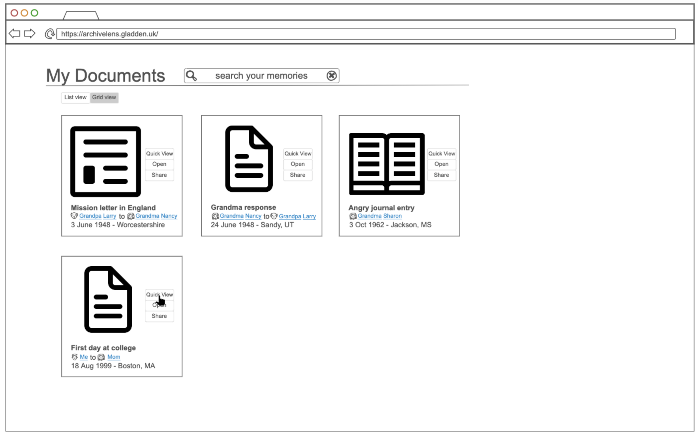
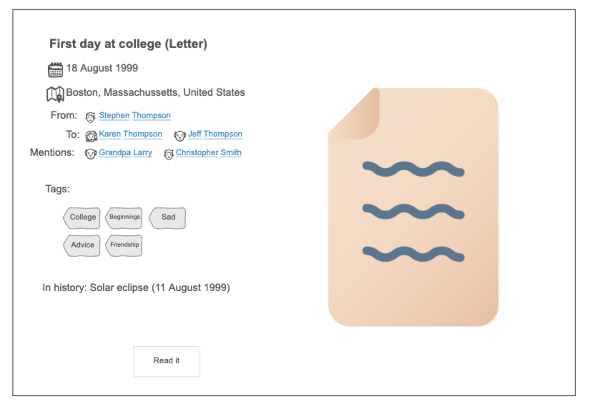
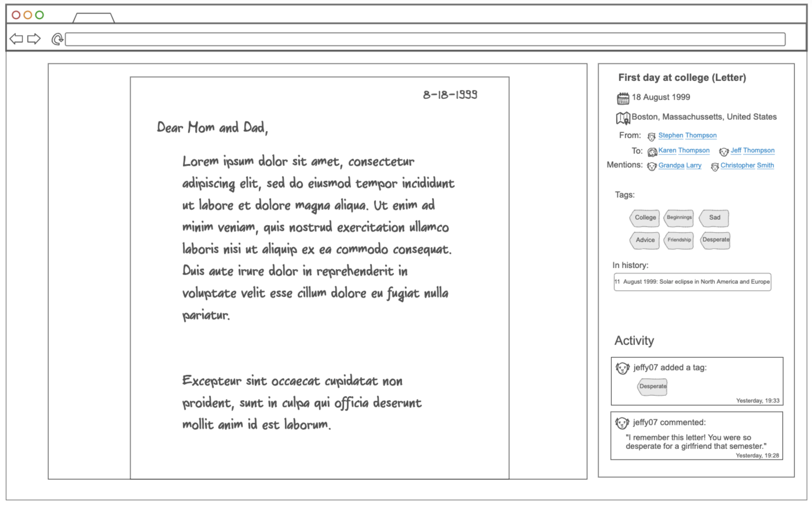

# Archive Lens
## Pitch
Just like me, you probably have a box of old letters and journals from your great grandpa, and you really don't want to throw it away. What are you even supposed to do with these letters? Store, view, and organize your family history memories in one place: Archive Lens. Users can easily upload documents such as journal pages or letters, then add metadata such as author(s), dates, and tags to easily find your documents later. Share your documents with other users, or even give them permission to contribute metadata or comments. Bonus feature: learn about historical events that happened around the same time that a document was written (found using a historical data API).
## Design

The main page will look a bit like this:

And document quick view will display a small overlay using React that looks something like this:

And viewing a document will go to a new page with more information and a document viewer that probably looks a little like this:

## Key Features
* Easily review and read uploaded documents
* Quickly find documents by author(s), date, or tag
* Filter permissions so that other users can (or can't) view, comment, or contribute
* Chat with other users to collaborate about a document or document author
* Discover what was happening in history on the same day a memory a journal entry or letter was written
## Technologies
Archive Lens will use the following technologies:
* **HTML:** An HTML page for logging in, an HTML page for viewing all your documents, and an HTML page for viewing a single documents and its metadata and comments.
* **CSS:** Organizes documents by grid or list view, chops up the page into sections so that a document is displayed on one side and information about it is displayed on the other.
* **JavaScript:** Search for documents by metadata
* **React:** Online viewer of documents, quick view document information, filter document list by search.
* **Service:** Backend endpoints for
  * Logging in
  * Retrieving documents and metadata
  * Searching for documents
  * Sharing documents and/or editing permissions
  * Adding comments or changes to a document
* **DB:** Stores account information, documents and metadata
* **WebSockets:** Provides real-time chat information (other user is typing) and instantly displays messages and other notifications.

## HTML Deliverable

The structure of the webpages builting using HTML.

 [x] **HTML pages:** A login page, an account creation page, a document viewer page, a document list page, and a share page.
 
 [x] **Links:** - All pages are linked in the navigation seciton.
    * All documents link to the document viewer
    * Authors link to the document list. Eventually they will link to a list of documents written by that author
    * All footers contain a link to the GitHub page

 [x] **Text:** Includes list items in navigation and document metadata. Paragraph text on about page. 

 [x] **Input/Interaction:** Lots of buttons! Lots of forms! Form for account creation, form for login. Submit buttons, back buttons, buttons, buttons!

 [x] **Images:** Document list includes document images. Footer contains GitHub SVG. Favicon on all pages. Document viewer includes document image. 

 [x] **DB/Login:** Input box and submit button for login. Document list is a dynamic list pulled from the database. Search results also pulled from database. Document viewer will pull document metadata from DB.

 [x] **WebSocket:** Search function will pull DB search results live on page. Sharing page will include live activity in messages section. 

## CSS Deliverable

[x] **Header, footer, main content body:**
  * Header stays up top and doesn't resize
  * Main content fills the page and doesn't overflow.

[x] **Navigation elements:** Navigation elements use bootstrap and look pretty. `.navbar-brand` was used to make my app logo look pretty.

[x] **Responsive to window sizing:** 
* Grid elements wrap to the next line. 
* Large lists that are too big for the screen have their own scrollbar. 
* Sidebars that are too large for mobile are either removed, or sidebar is moved below the principal content.

[x] **Animation:** Welcome page has a cool animation. I'm still working out the bugs.

[x] **CSS Frameworks:** Main content list uses bootstrap cards. Login forms use bootstrap as well. 

[x] **Images and media:** Sized properly to not look goofy. When necessary, added overflow scroll. 

[x] **Text content:** Text in correct places, stylized, and sized. Places for text to be generated from database. 

[x] **Application elements:** PDF-viewer sized and has its own scroll bar. Document list is in a grid. 

## React Deliverable Phase 1

[x] Bundled and transpiled using Vite
[x] HTML pages ported to React components:
* login
* document list
* document viewer (NOT found on the navigation tab: click one of the documents to see this page)
* sharing page
* about page
[x] All pages are routed on the main App. 

## React Deliverable Phase 2

This deliverable involves JavaScript and React. All database calls and API calls have been simulated.

[x] **Functionality mocked out:** 

* Create new account popup (Login)
* Create new document popup (Documents)
* Chat feature that uses `setTimeout` to receive a fake message (click `send message` on Sharing page to send/receive some messages)
* Send button on chat works (Sharing)
* Filtering on left side of document list page filters documents (search does not) (Documents)
* Loads more documents when you scroll to the end of the list (Documents)

[x] **Hooks:** `useState` and `useEffect` are used extensively for a reactive app. 

* Create new account form includes validation (email format, passwords match, etc.) (Documents)

## Services Deliverable
Implemented: authenticatio backend endpoints, document and document metadata endpoints

[x] Node.js/Express HTTP service
[x] Static middleware for frontend
[x] Calls to third party endpoints (click on a document and see "in history")
[x] Backend service endpoints - New users stored in memory, new documents stored in memory
[x] Frontend calls endpoints to show dynamic document data
[ ] PDFs are not showing on frontend (worked in dev, debugging required for prod)
[ ] Sharing page requires endpoints
[x] Supports registration, login, logout, and authentication endpoints
